Title: A streaming ALS implementation
Date: 2017-12-18 12:36


In this blog post I would like to talk a little bit about recommendation engines in general and how to build a streaming recommendation engine on top of [Apache Spark](https://spark.apache.org/).

I will start by introducing the concept of [collaborative filtering](#collab), and focus in two variants: [batch](#batch_als) and [streaming](#streaming_als) Alternating Least Squares (ALS). I will look at the principles of a streaming distributed recommendation engine on Spark and finally, I’ll talk about practical issues when using these methods.

## Recommendation engines

So what *are* "recommendation engines"?

Recommendation engines are a popular method to match *users*, *products* and historical *data* on user behaviour.                   

## Collaborative filtering <a name="collab"></a>                                            

In the majority of cases, we assume there’s a unique mapping between a _user_ $x$, a _product_ $y$ and _rating_ $\mathsf{R}_{x,y}$.

$$
\left(x,y\right) \mapsto \mathsf{R}_{x,y}
$$

The “collaborative” aspect refers to the fact that we are using collective information from a group of users and “filtering” is simply a synonym for “prediction”.

So, we use collaborative filtering quite frequently in our daily life and it really seems like common sense.

The main principle is that if a group of people tend to collectively have similar tastes, it is more likely that they agree on an unknown product.
Let’s imagine that you have a number of friends with whom you share a very similar musical taste, let’s call it `A` and another group, `B`, compared to which you have very different musical tastes. 
If group `A` and group `B` both recommend you a new album which they regard highly, which one would you pick?

You will probably pick the album from group `A`, right? So that’s collaborative filtering in a nutshell.

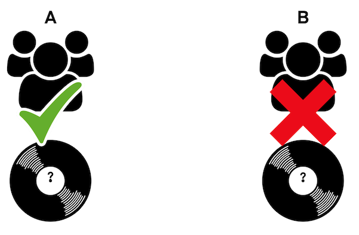

_Bonus question_: what if an album is considered really bad by group `B`? Does it mean you’ll like it?

It’s difficult to tell. Because group `A` has relevance to you, it’s easy to match. 
Because `B` is too dissimilar, a low rating is not very informative.

## Alternating Least Squares (ALS)

One of the most popular collaborative filtering methods is [_Alternating Least Squares_](https://link.springer.com/chapter/10.1007/978-3-540-68880-8_32) (ALS)
In ALS we assume that the available rating data can be represented in a sparse matrix form, that is, we will assume a sequential ordering of both users and products. Each entry of the matrix will then represent the rating for a unique pair of user and products.

If we then consider ratings data as a matrix, let's call it $\mathsf{R}$, the _user_ and _product_ ids will represent coordinates in a ratings matrix and the actual rating will be the value for that particular entry. To keep the notation consistent with the above we simply call the entry $(x,y)$ as $\mathsf{R}_{x,y}$. This will look something like the matrix represented in the figure below.

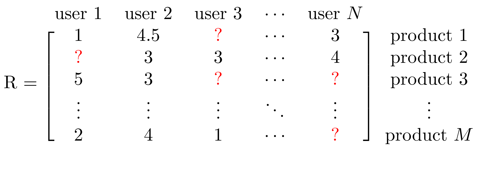

The idea behind ALS is to factorise the ratings matrix $\mathsf{R}_{x,y}$  into two matrices $\mathsf{U}$ and $\mathsf{P}$, which in turn, when multiplied back, will return an approximation of the original ratings matrix, that is:

$$
\mathsf{R} \approx \hat{\mathsf{R}} = \mathsf{U}^T \mathsf{P}
$$

To “predict” a missing rating for a user $x$ and product $y$, we can simply multiply two vectors, namely the $x$ row from the user latent factors and the $y$ column from the product latent factors, $\hat{\mathsf{R}}_{x,y}$, that is:

$$
\hat{\mathsf{R}}_{x,y} = \mathsf{U}_x^T \mathsf{P}_y
$$

There are several ways to tackle this factorisation problem and we will cover two of them in here. We will first look at a [batch method](#batch_als), which aims at factorising using the whole of the ratings matrix and a [stochastic gradient descent method](#streaming_als), which uses a single observation at a time.

### Batch ALS <a name="batch_als"></a>

This factorisation is performed by first defining an (objective) loss function (here called $\ell$). 
A general form is represented below where, as before, $\mathsf{R}_{x,y}$ is the _true rating_ and $\hat{\mathsf{R}}_{x,y}$ is the 
_predicted rating_, calculated as seen previously. The remaining terms are simply regularisation terms to help prevent overfitting.

$$
\ell = \sum c_{x,y} \left(\mathsf{R}_{x,y} - \underbrace{\mathsf{U}_x^T \mathsf{P}_y}_{\hat{\mathsf{R}}_{x,t}}\right)^2 + \lambda\left(\left\lVert \mathsf{U} \right\rVert^2 +  \left\lVert \mathsf{P} \right\rVert^2\right)
$$

The value of $c_{x,y}$ constitutes a penalisation function and will depend on whether we are considering _explicit_ or _implicit_ feedback. If we consider the _known_ ratings as our training dataset $\mathcal{T}$, then, in the case of explicit feedback we have

$$
c_{x,y} = \begin{cases}
0,\qquad\text{if}\ \left(x,y\right) \notin \mathcal{T} \\
1,\qquad\text{if}\ \left(x,y\right) \in \mathcal{T}
\end{cases}
$$

Constraining our loss function to only include known ratings. The implicit feedback case is different (and a possible future topic) and for the remainder of this post we will only consider the explicit feedback case. Given the above, we can then simplify our loss function, in the explicit feedback case, to
$$
\ell = \sum_{x,y \in \mathcal{T}} \left(\mathsf{R}_{x,y} -\hat{\mathsf{R}}_{x,y}\right)^2 + \lambda\left(\left\lVert \mathsf{U} \right\rVert^2 +  \left\lVert \mathsf{P} \right\rVert^2\right)
$$
Minimizing $\ell$ is however an NP-hard problem, due to its nonconvexity. However, if we treat $\mathsf{U}$ as constant, then $\ell$ is a convex in relation to $\mathsf{P}$ and if we treat $\mathsf{P}$ as constant, $\ell$ is convex in relation to $\mathsf{U}$. We can then alternate between fixing $\mathsf{U}$ and $\mathsf{P}$, changing the values such that the loss function $\ell$ (above) is minimized. This procedure is then repeated until we reach convergence.


The way that ALS works is, in simplified terms, to find the factors $\mathsf{U}$ and $\mathsf{P}$, which when multiplied together provide an approximation of our ratings matrix $\mathsf{R}$, as we've seen previously.

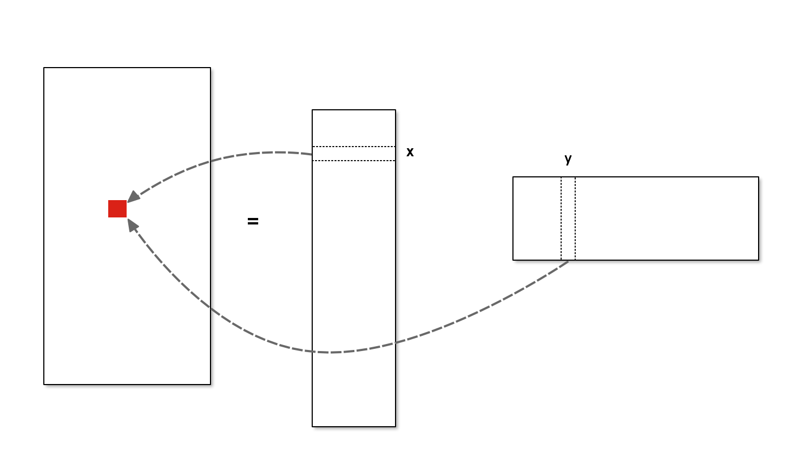

Once we have the factors $\mathsf{U}$ and $\mathsf{P}$, we can then predict the missing values in $\mathsf{R}$ by using the approximation $\hat{\mathsf{R}}$.

It is clear that in a real world scenario we would have *many* missing ratings, simply due to the assumption that no user rates all products (if they did, the case for a recommendation engine will be significantly weaker). ALS is designed to deal with sparse matrices and to fill the blanks using _predicted values_. After factorization, our approximated ratings matrix will look something like this:


As mentioned previously, the first step is then to minimise the loss function.  In this case we take the partial derivatives and set them to zero and fortunately this has a closed form solution. We get a system of linear equations which we can easily implement. The system will correspond to the solution of

$$
\frac{\partial \ell}{\partial \mathsf{U}_x}=0, \qquad \frac{\partial \ell}{\partial \mathsf{P}_y}=0.
$$

We start by solving the user latent factor minimisation using:

$$
\frac{1}{2}\frac{\partial \ell}{\partial \mathsf{U}_x}=0 \\
\frac{1}{2}\frac{\partial}{\partial \mathsf{U}_x} \sum_{x,y \in \mathcal{T}} \left(\mathsf{R}_{x,y} - \mathsf{U}_x^T \mathsf{P}_y\right)^2 + \lambda\left(\left\lVert \mathsf{U} \right\rVert^2 +  \left\lVert \mathsf{P} \right\rVert^2\right)=0 \\
-\sum_{x,y \in \mathcal{T}} \left(\mathsf{R}_{x,y} - \mathsf{U}_x^T \mathsf{P}_y\right)\mathsf{P}_y^T + \lambda \mathsf{U}_x^T=0\\
-\left(\mathsf{R}_x -\mathsf{U}_x^T \mathsf{P}^T\right)\mathsf{P} + \lambda \mathsf{U}_x^T=0\\
\mathsf{U}_x^T\left(\mathsf{P}^T \mathsf{P} + \lambda \boldsymbol{\mathsf{I}}\right) = \mathsf{R}_x \mathsf{P} \\
\mathsf{U}_x^T = \mathsf{R}_x \mathsf{P} \left(\mathsf{P}^T \mathsf{P} + \lambda \boldsymbol{\mathsf{I}}\right)^{-1}.
$$

Similarly, we can solve for the product latent factor by using:

$$
\frac{1}{2}\frac{\partial \ell}{\partial \mathsf{P}_y}=0 \\
-\sum_{x,y \in \mathcal{T}} \left(\mathsf{R}_{x,y} - \mathsf{P}_y^T \mathsf{U}_x\right)\mathsf{U}_x^T + \lambda \mathsf{P}_y^T=0\\
-\left(\mathsf{R}_y - \mathsf{P}_y^T \mathsf{U}^T\right)\mathsf{U} + \lambda \mathsf{P}_y^T=0\\
\mathsf{P}_y^T\left(\mathsf{U}^T \mathsf{U} + \lambda \boldsymbol{\mathsf{I}}\right) = \mathsf{R}_y \mathsf{U} \\
\mathsf{P}_y^T = \mathsf{R}_y \mathsf{U} \left(\mathsf{U}^T \mathsf{U} + \lambda \boldsymbol{\mathsf{I}}\right)^{-1}.
$$

We can then calculate each factor iteratively, by fixing the other one and solving the estimator. While this process is alternated, an error measure (usually the _Root Mean Squared Error_, or $RMSE$) is calculated (as below) between the rating matrix approximation given by the latent factors and the ratings which we have, $\mathcal{T}$. This method is guaranteed to converge and when we consider out approximation to be good enough, or after a set number of iterations we can then stop the refinement. 

$$
RMSE = \sqrt{\frac{1}{n}\sum_{x,y \in \mathcal{T}}\lvert \hat{\mathsf{R}}_{x,y} - \mathsf{R}_{x,y}\rvert}
$$

After the latent factors are estimated, we can then use them to try to recreate the original ratings matrix 
with the approximation as we've seen. The missing ratings in the original matrix will now be filled by values which minimize the least squares recursion and these are taken as the ratings "predictions".

To illustrate the working of ALS, let's assume we have a very quirky shop that only ever sells 300 products and has exactly 300 customers. On top of that, users are allowed to use 8 bit to rate the products. We will also assume in this unusual shop that every user has rated every product.

Now we're humans, and we visualise patterns in colour more easily than in numbers. We will assign a palette to the ratings, so that each rating corresponds to a colour.

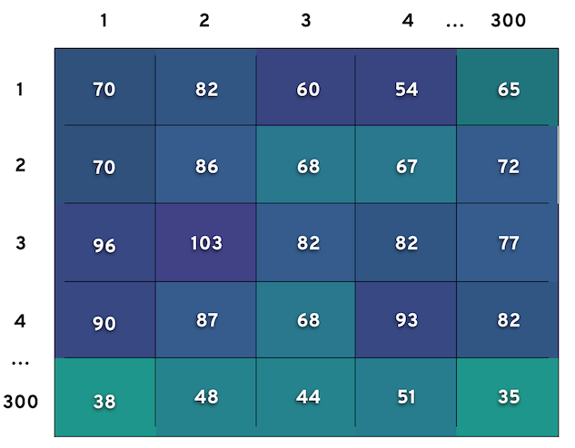

I think you know where this is going ... we make up this final ratings matrix so now we can visualise the ALS progress.

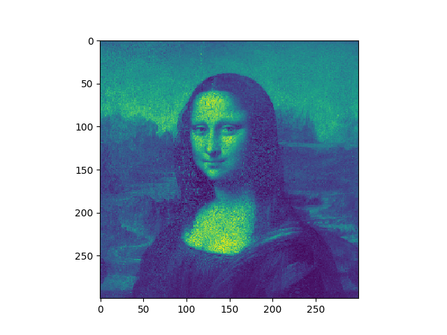

So how do we perform this factorisation? The initial step is to fill the latent factors ($\mathsf{U}$ and $\mathsf{P}$) with random values. Since at this point, we assume we don’t have any ratings, having random factors will lead to an initial random guess of the ratings matrix.

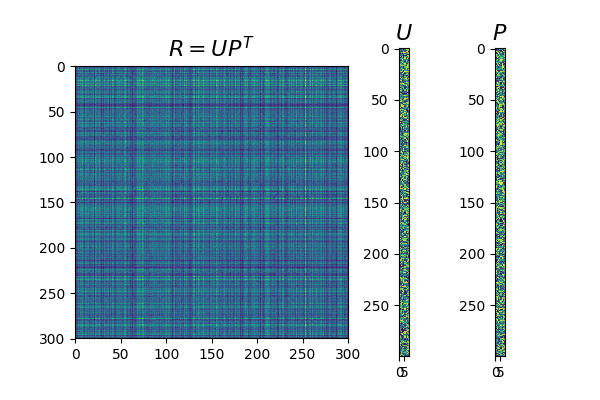

We then proceed to calculate each factor matrix, as we've seen, by calculating one using the estimator while keeping the other one constant and then alternating. We can see by the movie below that at each iteration the approximation to the original ratings gets better, stabilising after a few steps.

This is to be expected, in this case, since this would be the simplest implementation of ALS: a batch ALS on a single machine where we know all the ratings.



So a fair question that arises is: why can't we update this model and perform recommendations in a streaming fashion using this method? 
After all, if users add product ratings, we can simply update the predictions by recalculating the factors!

The problem is that when a new rating is added, or when new users and new products are added, we need to recalculate the entirety of the $\mathsf{U}$ and $\mathsf{P}$ matrices, and to do so, we need to have access to all of the data, $\mathsf{R}$.

### Streaming ALS <a name="#streaming_als"></a>

Ideally, we want a method that would allow us to update $\mathsf{U}$ and $\mathsf{P}$ using one observation, $\mathsf{R}_{x,y}$ at a time.

It turns out that the _Stochastic Gradient Descent_ (or SGD) method allows us to do precisely that. We'll look at the specific variant of SGD we've used which is called _Bias-Stochastic Gradient Descent_ (B-SGD).

It is important to keep in mind, under a certain point of view, both methods aim at the same thing.


They both try to factorise the ratings matrix as latent factors, which would then be used to perform predictions. The main differences are of course, how the data is used (batch or one observation at the time) and how the factorisation is calculated.

In the SGD case we use the concept of biases in both users and items. The bias is a measure of how consistently a product is rated by different users. The bias of rating $(x,y)$, that is the rating given by user $x$ to product $y$, can be calculated as the sum of $\mu$, an overall average rating and the observed deviations of user $x$, which we call $b_x$, and the observed deviations of product $y$, called $b_y$, that is:
$$
b_{x,y} = \mu + b_x + b_y 
$$
This bias information is now incorporated in the rating prediction.  We can see that the SGD prediction is simply the batch prediction plus the corresponding bias term.

$$
\hat{\mathsf{R}}_{x,y} = b_{x,y} + \underbrace{\mathsf{U}^T_x \cdot \mathsf{P}_y}_{batch}
$$

If we take the loss function definition for the batch method (and still considering the explicit feedback case), we can then replace the predicted rating formulation with our new one. We have, as before, some regularisation terms, but now also include a new regularisation term for the bias components, 
but we don’t need to go into that.


$$
\ell_{SGD} = \sum_{x,y \in \mathcal{T}} \left(\mathsf{R}_{x,y} - b_{x,y} - \hat{\mathsf{R}}_{x,y}\right)^2 + \lambda\left(\left\lVert \mathsf{U} \right\rVert^2 +  \left\lVert \mathsf{P} \right\rVert^2 + b_x^2 + b_y^2\right)
$$

Since calculating the full gradient is computationally very expensive, we calculate it for a single observation. As we can see, the SGD method allows us to update the user and product specific bias as well as a single user and product latent factor row given a single rating.

Provided we have a single rating, the rating of user $x$ for product $y$, we can update the biases as well as the latent vectors for user $x$ and for product $y$, that is, we no longer need to update the entire matrices $\mathsf{U}$ and $\mathsf{P}$, while still maintaining a convergence property.

Provided with a learning rate $\gamma$ and defining our _prediction error_ as
$$
\epsilon_{x,y}=\mathsf{R}_{x,y}-\hat{\mathsf{R}}_{x,y},
$$
the biases and latent factors can now be updated in the opposite direction of the calculated gradient, proportionally to the learning rate, such that
$$
\begin{align}
b_x &\leftarrow b_x + \gamma \left(\epsilon_{x,y}-\lambda_x b_x\right) \\
b_y &\leftarrow b_y + \gamma \left(\epsilon_{x,y}-\lambda_y b_y\right)
\end{align}
$$

$$
\begin{align}
\mathsf{U}_x \leftarrow \mathsf{U}_x + \gamma \left(\epsilon_{x,y}\mathsf{P}_y - \lambda^\prime_x \mathsf{U}_x\right) \\
\mathsf{P}_y \leftarrow \mathsf{P}_y + \gamma \left(\epsilon_{x,y}\mathsf{U}_x - \lambda^\prime_y \mathsf{P}_y\right)
\end{align}
$$

So the practical difference, in terms of streaming data is evident now. Given that, in both methods, the objective is to estimate the latent factors, given the ratings: with batch ALS, whenever we get a new rating, we need to fully recalculate the factors iteratively until we reach convergence. Conversely, with an SGD based factorisation, whenever we have a new rating, we can simply estimate the relevant row and column in the latent factors, by calculating the gradients and adjusting its values.

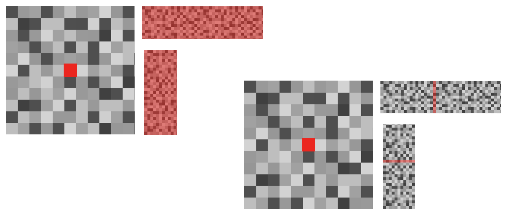

Next we show the previous manufactured ratings matrix being factorised using B-SGD. We now simply recalculate the biases and a single latent factor vector, one observation at the time. We can see that, as expected, the convergence is slower (we *are* using a single observation at each step) but in the end, it produces a similar result.



Now, this works fine for a single machine implementing streaming ALS. But we are interested in scaling this to something larger than this example so we will use a distributed implementation of ALS. And this is were it can start to get tricky.  As it is the case with distributed algorithms, there are some pitfalls which we need to avoid in order to have a performant implementation. We will look at a few of these by looking at the Apache Spark’s and its default ALS implementation.

### Apache Spark

As probably most of you are familiar with, Spark is an Apache community project which aims at providing a modern platform for distributed computations. Spark provides several core data structures, such as `RDD`s (_[Resilient Distributed Datasets](https://spark.apache.org/docs/latest/rdd-programming-guide.html#resilient-distributed-datasets-rdds)_), `Dataframes` and `Datasets`.

The `RDD` is an immutable, distributed typed collection of objects. The `RDD` is partitioned across the cluster. This allows the spark operations, such as function mapping, to be applied to each subset of the `RDD` in parallel at each partition.

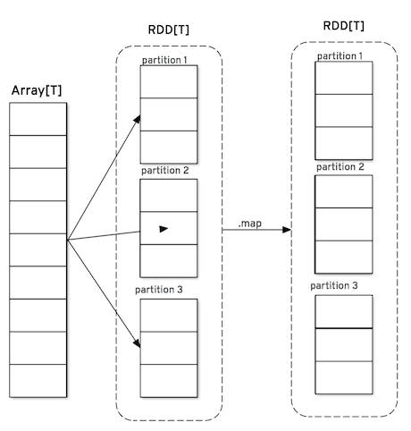

For the streaming ALS application we will use `RDD`s to implement the algorithm. Spark’s MLlib provides a collaborative filtering implementation based on the distributed batch ALS which we’ve covered previously. The API is quite simple and to train a model we need:

```Scala
val model = ALS.train(ratings, rank, iterations, lambda)

case class Rating(int user, int product, double rating) 

val ratings: RDD[Rating]
val rank: int
val iterations: int
val lambda: Double
```

 * An `RDD` containing the ratings. The `RDD` has elements of the class `Rating`, which is basically a wrapper around a tuple of user id, product id and rating. This `RDD` corresponds to all the entries in our ratings matrix used previously.
 * The `rank` which corresponds to the number of elements in our latent factor vectors (this would be the number of columns or rows in our $\mathsf{U}$ and $\mathsf{P}$ matrices).
 * A stopping criteria in terms of iterations for the ALS.
 * And finally, we set the `lambda` parameter, a regularisation parameter, which we’ve shown to be a part of the loss function’s regularisation.

Since we have the data, the question is then how to choose the parameters. A typical method is to split the original ratings data into two random sets, one for training and one for validation. We then proceed to train the model to several different parameters, usually according to a grid search, and calculate some error measure between the predicted and validation ratings, choosing the parameters which minimise the error.

Once the model is trained, we get a `MatrixFactorizationModel` instance, which is basically a wrapper for the latent factors as `RDD`s.

```Scala
> val model = ALS.train(ratings, rank, iterations, lambda)

model: MatrixFactorizationModel

class MatrixFactorizationModel {

val userFeatures: RDD[(Int, Array[Double])]
val productFeatures: RDD[(Int, Array[Double])]

}
```

One we have the trained model, we can now perform predictions.

### Streaming data

We now want to build a streaming recommender system. For this scenario, we will assume that the observations take the form of a Spark’s _Discretised Stream_ or [DStream](https://spark.apache.org/docs/latest/streaming-programming-guide.html#discretized-streams-dstreams). With DStreams we consume the stream as mini-batches of `RDD`s over a certain interval window.

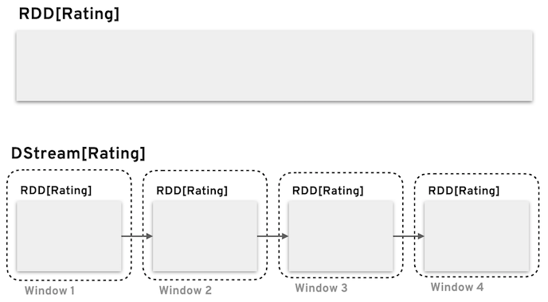

We can for instance, use the first mini-batch to initialise the model and the following batches to continuously train the model.

One immediate advantage of using observations as a stream is that we no longer need to keep the entirety of the data in memory or read it from storage. If we consider the batch implementation with a very large dataset if we had a single new observation and wanted to retrain the model, we would have to, for instance, read several million ratings from a database. With a streaming variant we can use that single observation to update the latent factors.

We will try to recreate Spark’s batch ALS API by allowing model training using a ratings `RDD`, however this time, we consume each `RDD` from the stream mini-batch and will incrementally train the model as observations trickle in.

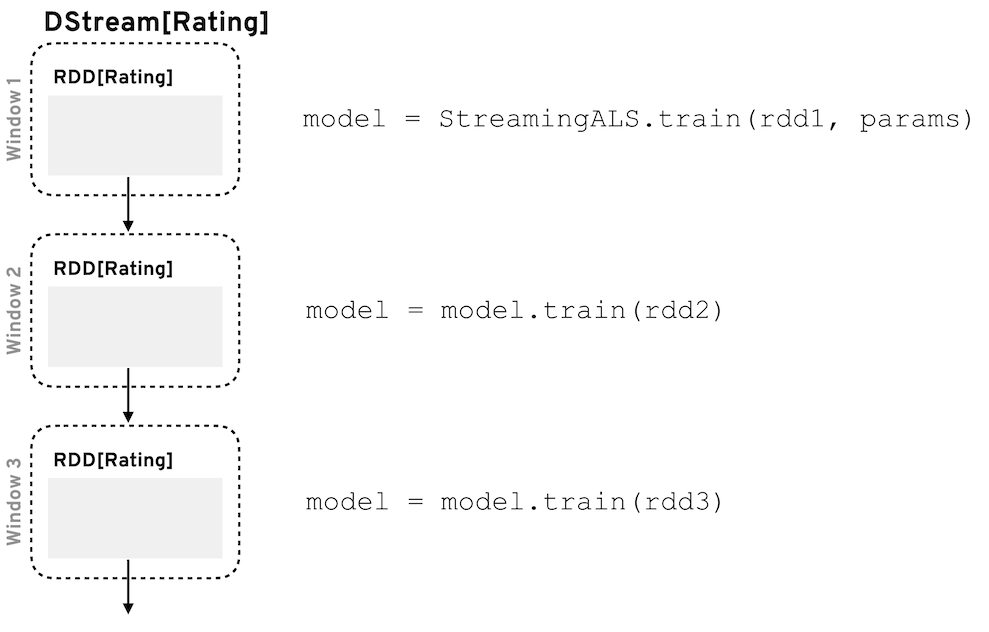

First, we start by establishing the quantities and data structures needed to implement streaming ALS.

We’ve seen in the previous slides that the recursions for the gradient calculation take the following form, here presented in pseudo-code:

```scala
userBias += gamma * (error - lambda * userBias) 

userFeature(i) += gamma * (error *  prodFeature(j) - lambda * userFeature(i))
```

We create a `Factor` class to encapsulate the features and the corresponding bias.

We recall that in the Spark ALS implementation, the features were stored in `RDD`s typed as a tuple of `(id, Array)`, where now we have an equivalent form of `(id, Factor)` which allows us to capture the bias. I’ll now provide a quick overview of the steps required to go from the initial ratings stream to the trained model, in terms of Spark’s `RDD` operations. 

Similarly to Spark’s ALS, we can assume that the model data will be in the form of `Rating`’s `RDD`s. These, as we’ve seen, will correspond to a mini-batch of ratings from our data stream. We first need to create the initial user and product latent factors for the observed data and we would start by creating two separate `RDD`s from the data, one keyed by user id, the other by product id.

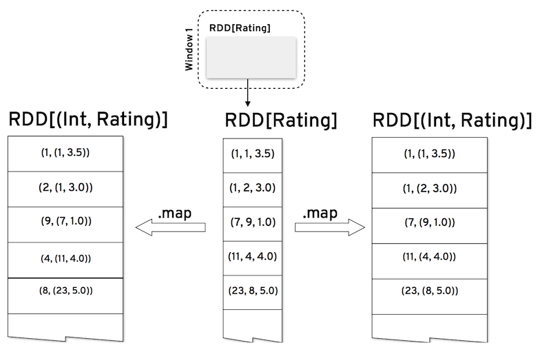

For each entry of those new `RDD`s (the user and product indexed ones) we will now generate a random vector of features. This can be done by simply filling a vector of size `rank` with random uniform values, but as you will recall, we now also have a bias associated with each entry, which will initially also be set to a random value.


We now join the incoming ratings, with the generated user factors (using the user id as the key) getting a resulting `RDD` consisting of product ids, user ids, ratings and user factors (and the same thing for products and product factors).

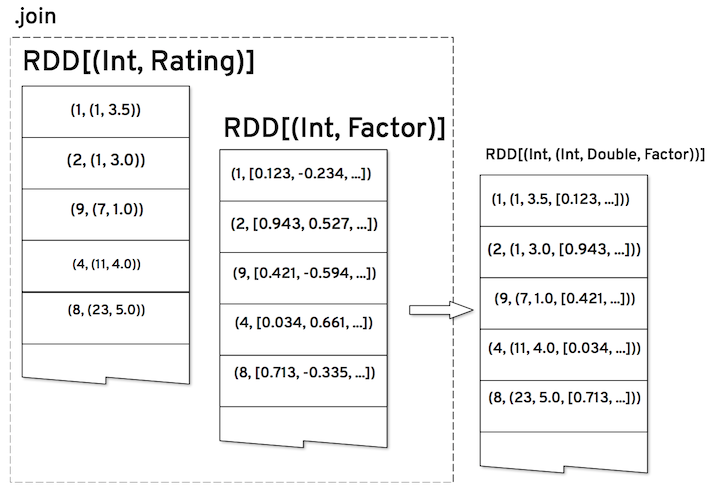

Finally, we have these two joint `RDD`s which have all the necessary quantities needed to calculate the partial gradient in each element. Recalling how to calculate a predicted rating in streaming ALS, we need the global bias, the user and product bias and the corresponding user and product latent vectors.
This is straightforward to calculate for each element as we can see from the pseudo-code.

Here the `dot` function is simply a function to calculate the dot product treating the two factor arrays as vectors.

$$
\hat{\mathsf{R}}_{x,y}=\mu + b_x + b_y + \mathsf{U}_x^T \cdot \mathsf{P}_y
$$

```scala
prediction = dot(userFactors.features, itemFactors.features) + userFactors.bias + itemFactors.bias + bias
```

Given the prediction, the error is also straightforward to calculate, since the real rating is also included in this `RDD`.

$$
\epsilon_{x,y} = \mathsf{R}_{x,y} - \hat{\mathsf{R}}_{x,y}
$$

```scala
eps = rating - prediction
```

And now, since we have the error, we can also easily calculate the update term for the user and product features. As mentioned previously,  `gamma` and `lambda` are known model parameters which we pick ourselves when instantiating the streaming ALS algorithm.

$$
\gamma \left(\epsilon_{x,y}\mathsf{U}_x-\lambda^{\prime}\mathsf{P}_y\right)
$$

```scala
(0 until rank).map { i => 
	gamma * (eps * userFactors.features(i) - lambda * itemFactors.features(i))
}
```

Finally, we update the user and product biases given the model parameters and the previous bias.

$$
\gamma \left(\epsilon_{x,y}-\lambda_y b_y\right)
$$

```scala
gamma * (eps - lambda * itemFactors.bias)
```

These calculated gradients can now be mapped to a new `RDD` which we will use to update the final biases and latent factors.

The last step is to split the gradients according to user and product, and finally, when in possession of all the individual gradients, we reduce them into latent factors by performing an aggregated sum for each user and product.

So these steps define the entirety of the streaming ALS operation. For each observation window, we calculate the latent factors `RDD`, and on the following window we update these factors, given the current observations.

We’ve covered the initialisation case, that is, we assumed the case where the model is not initialised and we received the first mini-batch of ratings. If, on the following window, we receive ratings for previously unseen user or products, the procedure is exactly the same, that is, we generate random factors and update as described.


Now I’ll just quickly cover the case where we get some ratings from users or for some product we’ve already seen. For this new set of observations, we proceed exactly as previously, that is, we split the data into separate `RDD`s, each one containing the ratings but keyed by user and product id. I’ll assume that we get a mixture of completely new data, that is, unseen user and products and some ratings for previously seen users and products shown in red.

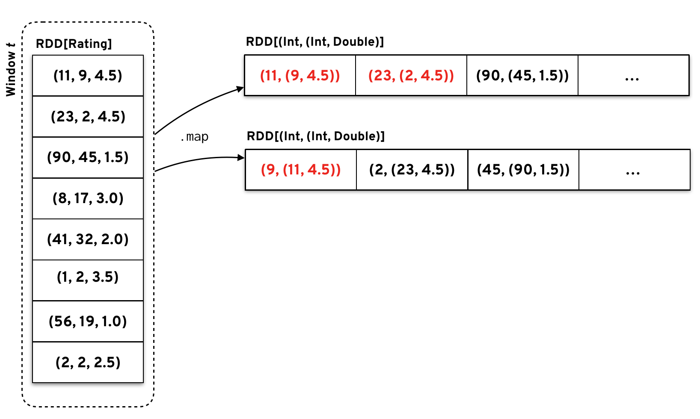

The difference now is that, instead of assigning random factors and biases to each entry of these `RDD`s, we perform a  full outer join between them and the current latent factors.

The strategy is then to keep the matching existing latent factor and create random features and biases just for the user and product entries we haven’t seen before.

Now that we are in possession of this joint `RDD`, we can apply exactly the same steps as previously to update the factors and repeat these steps for all future incoming observations, allowing us to continuously update the model.

It is now easy to see that, in the limit situation where we only have one new rating, we would now only have to update a single entry of the latent factors `RDD`, in contrast with the batch method, where the entirety of the factors would be used in the ALS step.


Let's look at some results comparing the streaming implementation with the Spark’s batch implementation.

The dataset we have chosen to use in these tests is one of the [MovieLens' datasets](https://grouplens.org/datasets/movielens/latest/). These dataset are a widely used data in recommendation engine research. They are managed by the Lens corporation and are freely available for non-commercial applications.

These datasets come in several variants, namely a [small](http://files.grouplens.org/datasets/movielens/ml-latest-small-README.html) variant, useful for a quick algorithm prototyping and testing, and a [full](http://files.grouplens.org/datasets/movielens/ml-latest-README.html) variant, with approximately 26 million ratings (from 45,000 movies and 270,000 users), useful for a more comprehensive testing and benchmark.

The data is available as a set of Comma Separated Value files, each containing different variables, but we are mainly interested in the `ratings` file which contains four variables: a unique user and movie id, represented as integers, a rating represented by a value from 0 to 5 with steps of 0.5 and a timestamp for when the movie was rated by this user.

First, we’ll start by training a batch ALS model using the MovieLens data. We assume that we already have the observations as an `RDD` of ratings and simply split the data into 80% for training and 20% for validation.

```scala
val split: Array[RDD[Rating]] = ratings.randomSplit(0.8, 0.2)

val model = ALS.train(split(0), rank, iter, lambda)
```

Here, we won’t show the steps to determine the best parameters for this dataset, were we performed a simple parameter grid search over a number of possible candidates. The Spark ALS API is quite simple and to train the model we simply pass the training `RDD` and the parameters.

We can now use the remaining 20% of the observations to calculate the RMSE between the model predictions and the actual ratings.

We now can persist the validation `RDD`, so we can use the exact same one for the streaming ALS run.

```scala
val predictions: RDD[Rating] = model.predict(split(1).map { x =>
(x.user, x.product))
}

val pairs = predictions.map(x => ((x.user, x.product), x.rating))
  .join(split(1).map(x => ((x.user, x.product), x.rating))
  .values

Val RMSE = math.sqrt(pairs.map(x => math.pow(x._1 - x._2, 2)).mean())
```

In order to test the streaming version, we first need to define a data source. We start with the original MovieLens data and remove all the ratings from the validation observations.

We then create a simulated stream of observations using [Kafka](https://kafka.apache.org/), with an interval of 5 seconds and with 1000 observations in each mini-batch. These are arbitrary numbers, chosen just for practical reasons. We could have, for instance, a single observation in each mini-batch.

It is not guaranteed that the best parameters (namely `rank` and `lambda`) chosen for the batch version are the best for the streaming implementation, however we’ve decided to use the same ones. For each mini-batch we then incrementally train the model and calculate the RMSE up to that point. Given the actual ratings in the validation set and the model’s prediction, the RMSE calculation is the same as in the batch version. And looking at the results, we can see that with each mini-batch (of 1000 observations), the RMSE from the streaming version (in blue) is edging towards the batch value (plotted as the horizontal dashed line). 

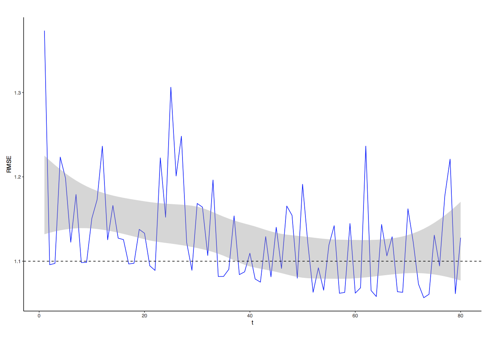

### Caveats

However, streaming ALS has pitfalls which we have to take into account.

#### Cold start

An issue, which is shared with batch ALS, is usually called the _cold start_ problem. This refers to initial point in a recommender engine where we have too few observations to make meaningful predictions. As we now know, when having a small number of ratings, since our latent factors are initialised to random numbers, most of our predicted ratings will also be random.

Although this is not an exclusive problem to the streaming implementation, we might be tempted, since the system is suited for realtime recommendations, to immediately start serving predictions. It might be wise to exercise caution and train the model offline with a larger dataset or at least perform some model diagnostics to check how sensible our predictions are.

#### Hyperparameter estimation

Another challenge we encounter is hyperparameter estimation.

In the batch ALS case, we can perform a grid search for instance and estimate the hyperparameters. If, after some time, we find ourselves with a new ratings or even new product and users, we can simply repeat this procedure using the totality of the data. As an example, if in batch ALS at any point we wish to estimate the model with a different rank, this would be perfectly acceptable

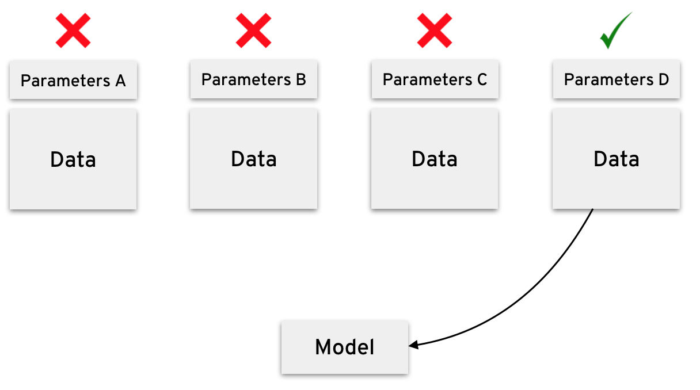

In the streaming case, we can’t do that. When we have a new batch of observations, we assume that previous ones were discarded since they are already incorporated in the latent factors. If they weren’t and we keep all the observations in the stream, we might as well use batch ALS.

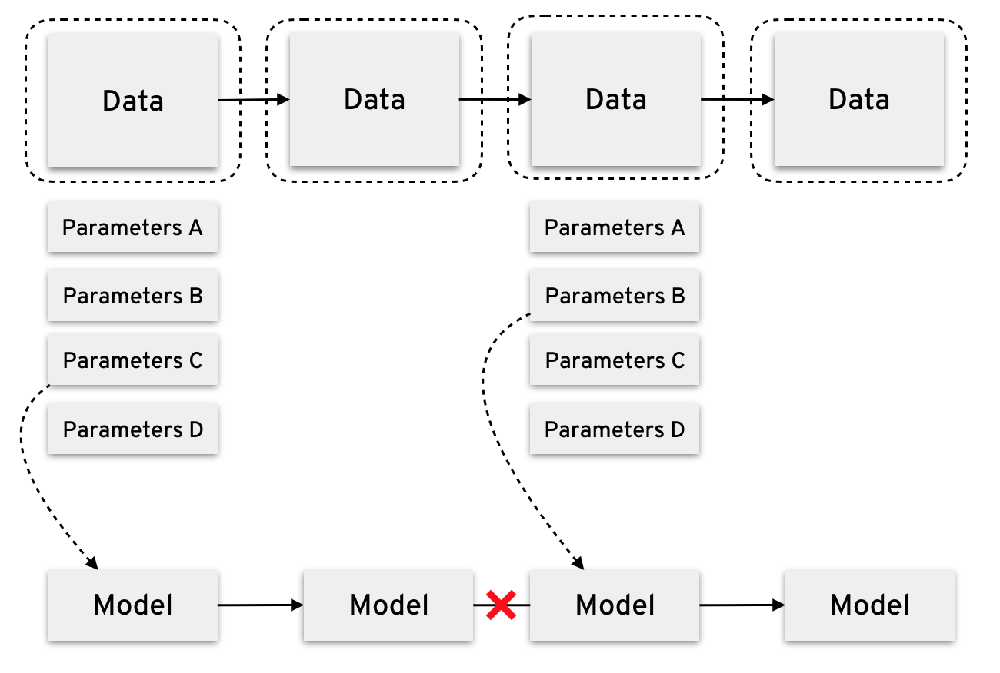

A solution is to perform a grid search in parallel from the start and prune the least performant models as time progresses. This has the disadvantage of being expensive in terms of resources, since we have to keep several models simultaneously and again, we have the cold start problem surfacing.
This means that we have no guarantee that the best parameters for a initial batch with few observations will still be the best further on.

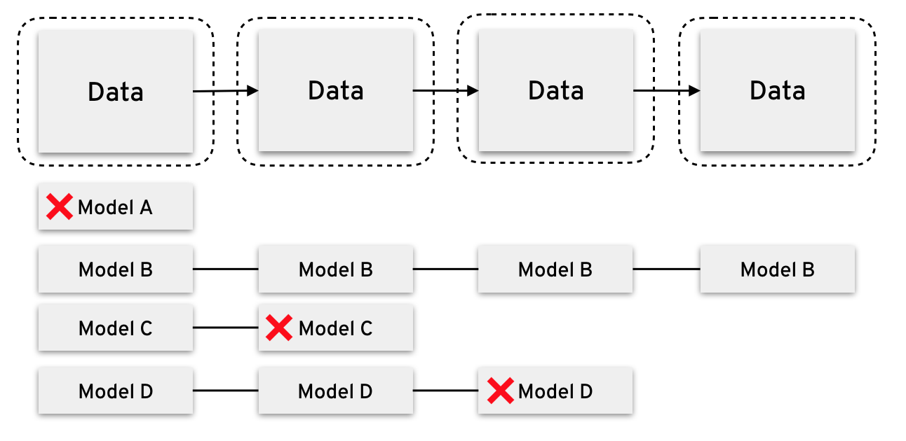

#### Performance

Also, there are some performance considerations. As we’ve seen, we implement some operations which can be costly in a Spark setting. We have several join operations which can lead to a considerable amount of data shuffling between partitions.

Care must be taken into choosing an appropriate partitioning strategy to minimise data shuffling.

Spark’s implementation of batch ALS uses a specific method called blocked ALS, which computes outgoing and ingoing links between user and products vectors and then partitioning them in blocks in order to minimise data transfer between nodes. 

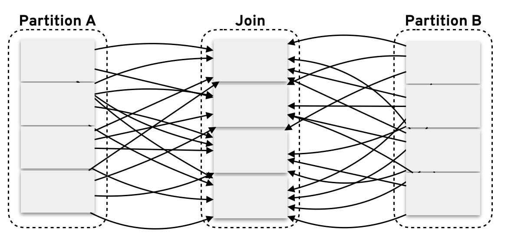

Also, to make predictions we might have to try and perform random access to the latent factors `RDDs`. This also can be quite inefficient since we are using `lookup` methods.


If you want to get straight setting up your own distributed recommendation engine, I highly suggest you start with Spark's builtin solution. I would highly recommended looking at the `jiminy` project (part of the [https://radanalytics.io/](https://radanalytics.io/) community), a micro-service oriented complete recommendation engine, ready to deploy on [OpenShift](https://www.openshift.com/).

The engine is split into services such as a [predictor](https://github.com/radanalyticsio/jiminy-predictor) and a [modeler](https://github.com/radanalyticsio/jiminy-modeler), along with a [front-end](https://github.com/radanalyticsio/jiminy-html-server) and [tools](https://github.com/radanalyticsio/jiminy-tools) to simplify tasks (such as using the MovieLens data) and it's a great way to look at how to put a modern recommender engine together and also a great code read.

